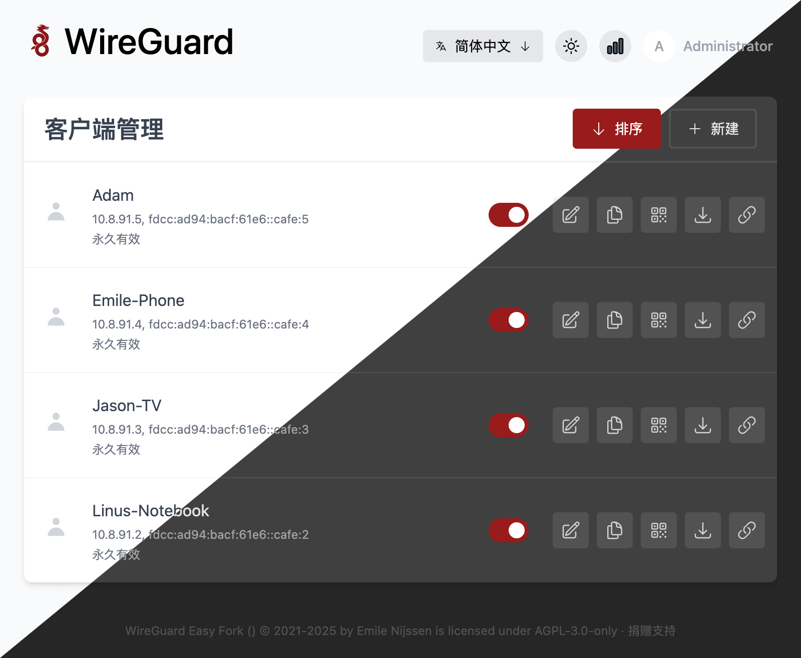
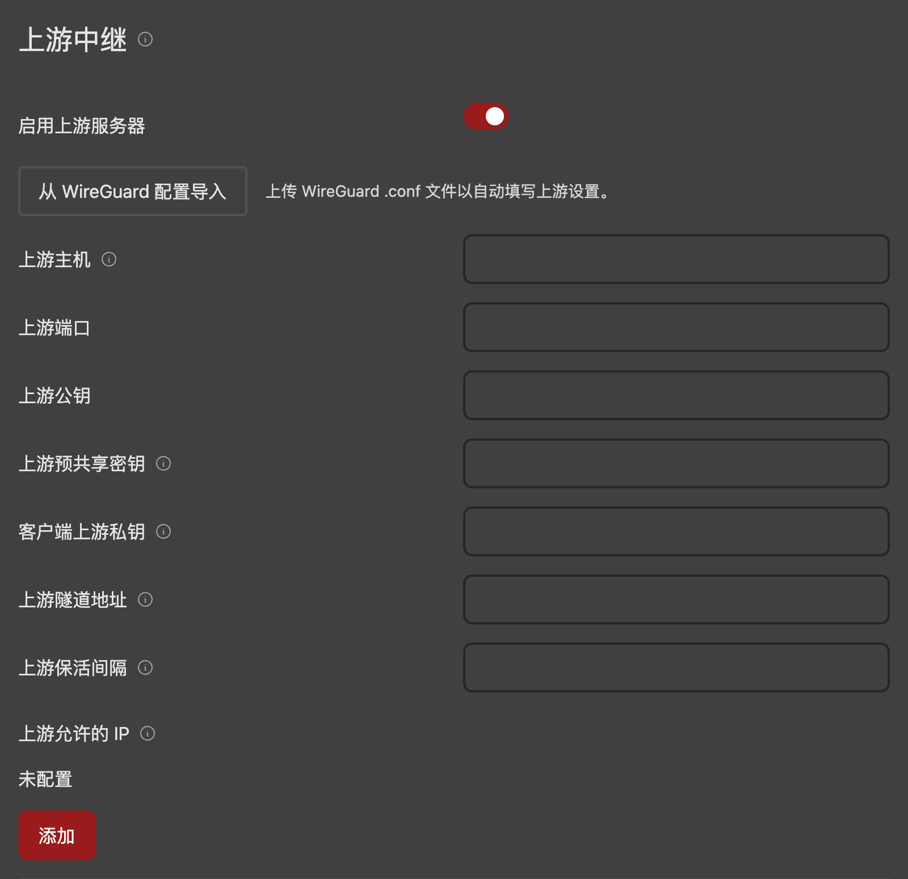
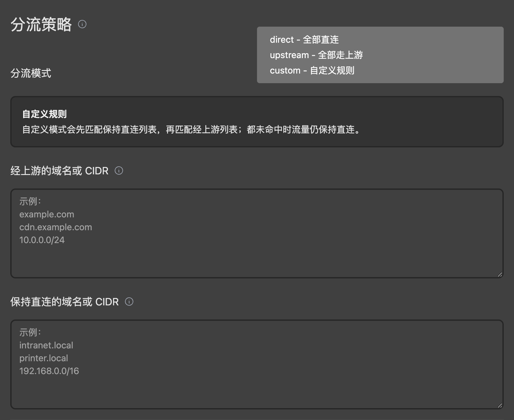

# WireGuard Easy Fork

[](https://github.com/kuaifan/wg-easy/actions/workflows/deploy.yml)
[](LICENSE)
[](https://github.com/kuaifan/wg-easy/releases/latest)

本仓库基于官方项目 [wg-easy/wg-easy](https://github.com/wg-easy/wg-easy) 进行二次开发，保留原始体验，主要文档仍以官方站点为准：<https://wg-easy.github.io/wg-easy/latest/>。当前版本号为 `15.1.0-upstream.1`，主要新增内容如下：

- 新增客户端上游服务器分流配置。
- 自定义分流模式提供代理/直连/自定义规则。
- 客户端卡片支持一键复制配置。
- 默认随机分配客户端内网网段。

详细更新记录见 [CHANGELOG-UPSTREAM.md](./CHANGELOG-UPSTREAM.md)。

<p align="center">
  
  
  
</p>

## 安装指南

以下步骤基于官方文档的基础安装流程，示例目录为 `/etc/docker/containers/wg-easy`，可按需调整。

1. **准备环境**
   - 一台可自行管理的主机（支持 x86_64、arm64、armv7 架构）
   - 可访问的公网 IP 或域名
   - 已安装 `curl`

2. **安装 Docker**

   参考 <https://docs.docker.com/engine/install/> 完成 Docker 安装，或在主机上执行：

   ```shell
   curl -sSL https://get.docker.com | sh
   exit
   ```

   重新登陆后继续执行后续步骤。

3. **拉取配置与启动**

   ```shell
   sudo mkdir -p /etc/docker/containers/wg-easy
   sudo curl -o /etc/docker/containers/wg-easy/docker-compose.yml \
     https://raw.githubusercontent.com/kuaifan/wg-easy/upstream/docker-compose.yml
   cd /etc/docker/containers/wg-easy
   sudo docker compose up -d
   ```
   默认镜像指向 `ghcr.io/kuaifan/wg-easy:15.1.0-upstream.1`，可按需调整标签。

4. **开放防火墙端口**
   - 默认 WireGuard 端口：UDP `51820`（若修改配置，请同步调整防火墙策略）

5. **可选：配置反向代理**
   - Traefik、Caddy 等示例可参考官方文档对应章节。
   - 如无需反向代理，可参考官方的 “No Reverse Proxy” 指南直接开放服务端口。

6. **更新到新版**

   ```shell
   cd /etc/docker/containers/wg-easy
   sudo docker compose pull
   sudo docker compose up -d
   ```

## 许可证

本项目沿用原仓库协议，遵循 [AGPL-3.0-only](LICENSE)。本项目与 Jason A. Donenfeld、ZX2C4 或 Edge Security 无官方关联；“WireGuard” 及其 Logo 为 Jason A. Donenfeld 的注册商标。
